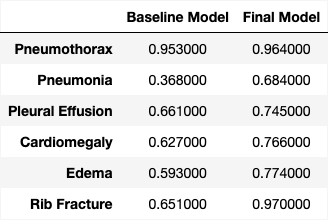

# Medical_LLM

This model is built upon the LLaVA framework - Large Language and Vision Assistant. You can find the repo here: https://github.com/haotian-liu/LLaVA/tree/main

The objective of this model is to streamline the evaluation process of radiology reports, which is currently performed manually by professional radiologists. Our goal is to develop a model capable of interpreting X-ray images and autonomously generating detailed radiology reports, thereby enhancing efficiency and accuracy in medical diagnostics. 

To finetune the model on custom data, follow the instructions on this page: https://github.com/haotian-liu/LLaVA/blob/main/docs/Finetune_Custom_Data.md

### Train

Update file paths to data and images, as well as training parameters, and run
`sh LLaVA/scripts/v1_5/finetune_task_lora.sh`


### Evaluation
#### 1. Generate responses

Run inference on a single X-ray image
`python3 -m llava.serve.cli —model-path path_to_model —model-base path_to_llava-v1.5-13b —image-file path_to_img_folder/*.jpg`

Run inference on a set of data
```python

python3 LLaVA/llava/eval/model_vqa.py \
    --model-path path_to_trained_model \
    --model-base llava-v1.5-13b \
    --question-file question_prompt.jsonl \
    --image-folder path_to_image_data \
    --answers-file validation_responses.jsonl

```

#### 2. Evaluation of Diagnostic accuracy of LLaVA

**LLM - ChatGPT 3.5 Turbo:**
we used OpenAI's ChatGPT 3.5 Turbo model API to extract the different disease entities from both radiologist and LLaVA reports. This approach allows us to assess LLaVA's performance and accuracy through a comparative analysis by disease. The 6 disease entities we focused on are:
- Pneumothorax
- Pneumonia
- Pleural Effusion
- Cardiomegaly
- Pulmonary Edema
- Rib Fracture

The table below shows the performance results of the baseline model and the final model:



**NLP Approach**
